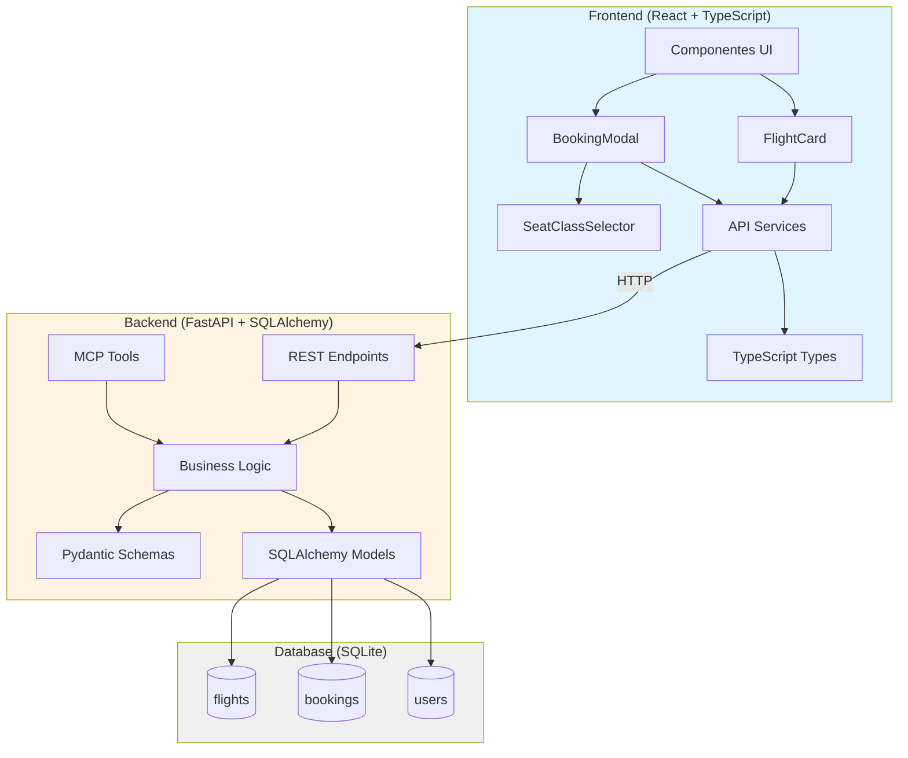
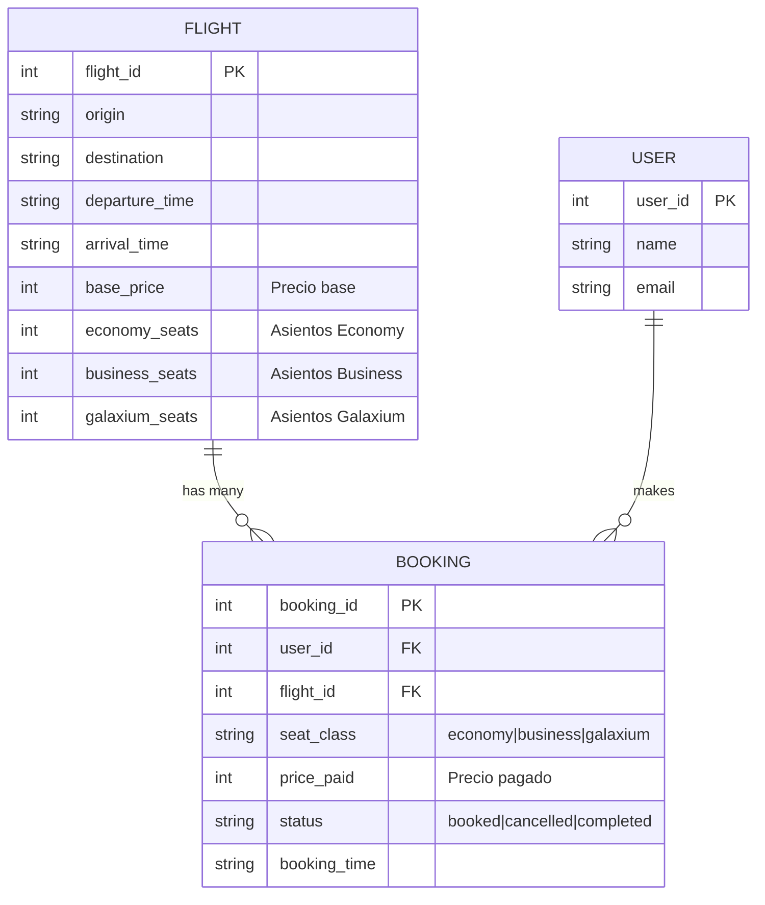
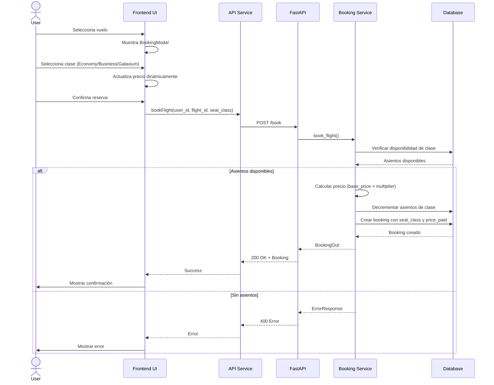
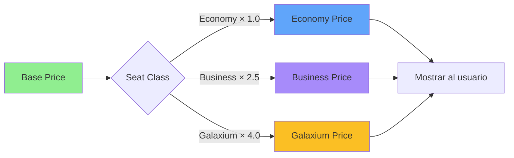
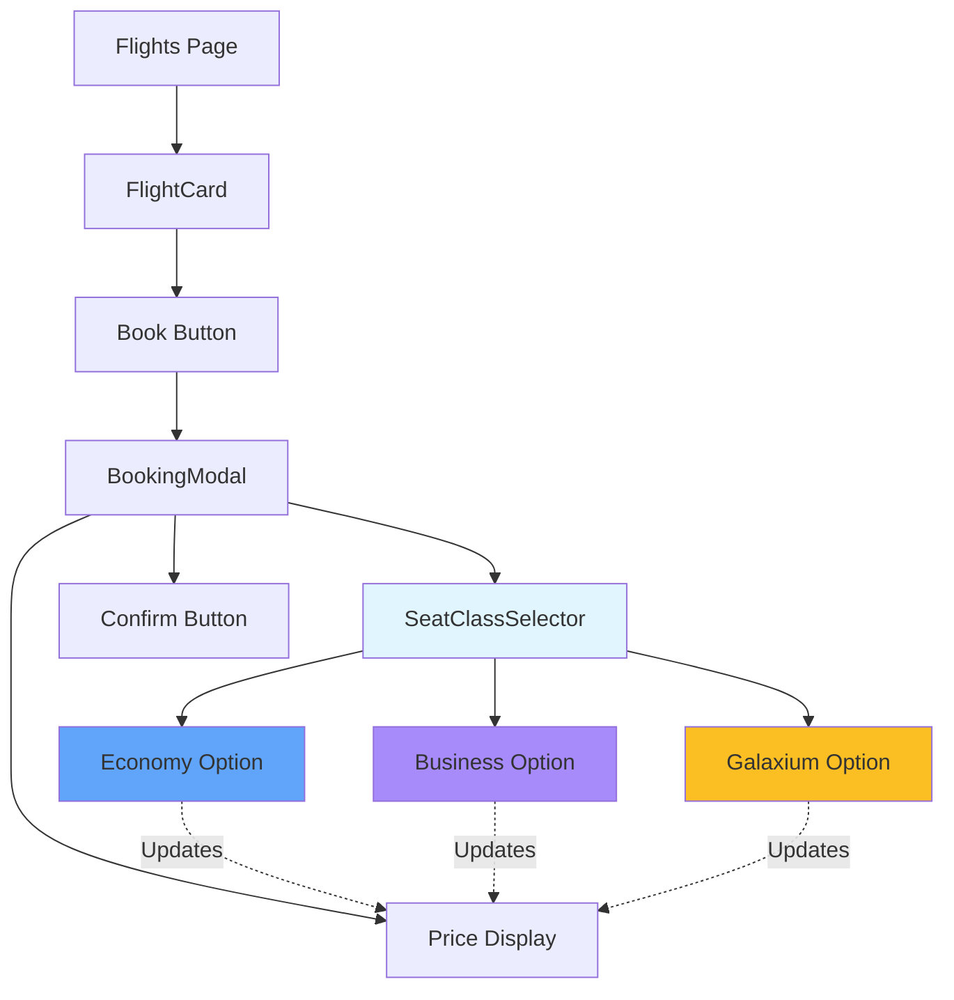
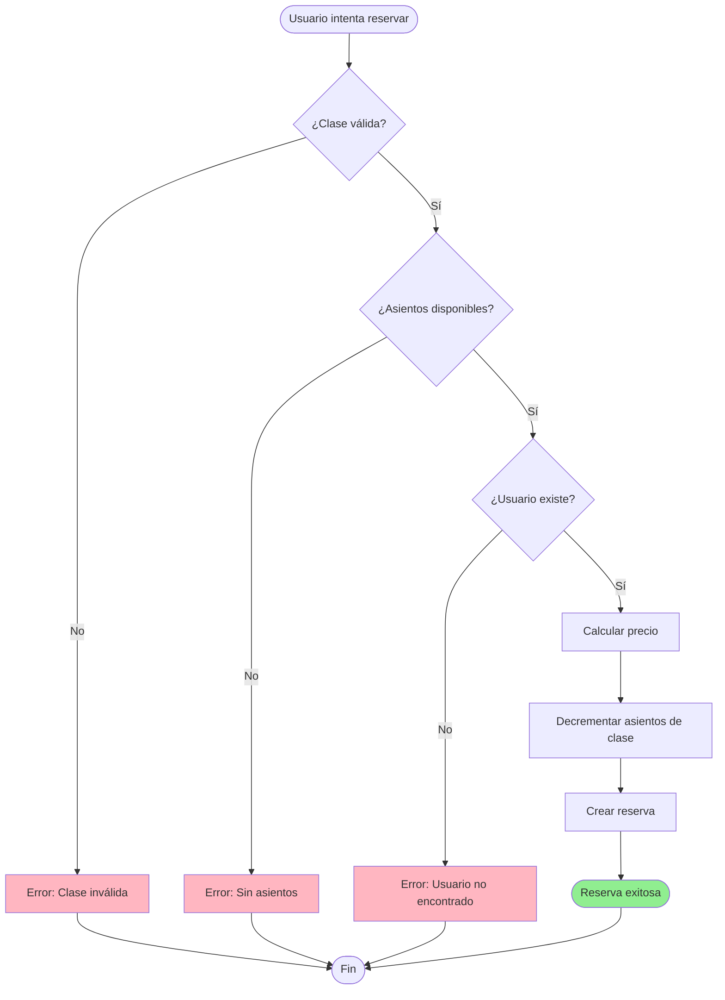
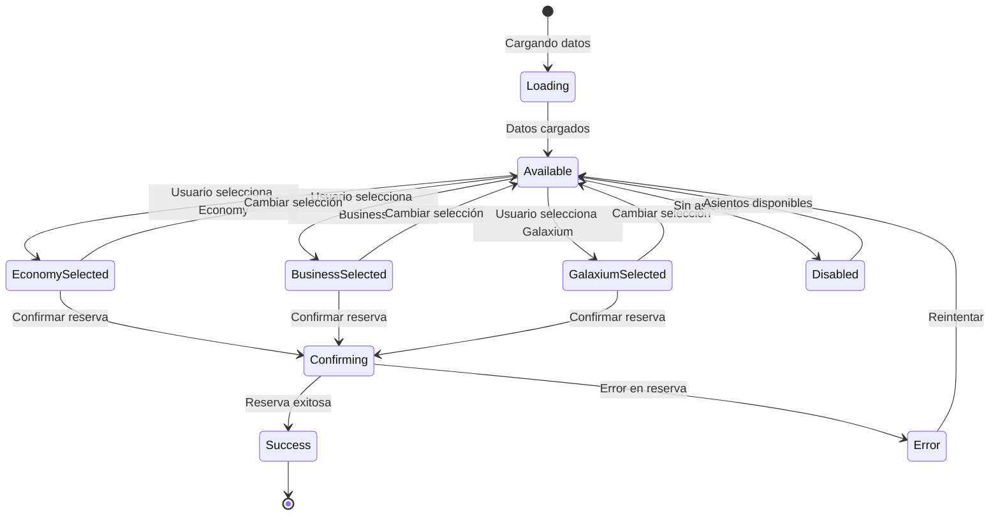
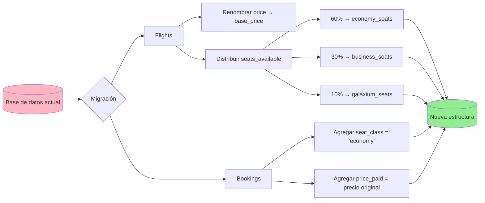
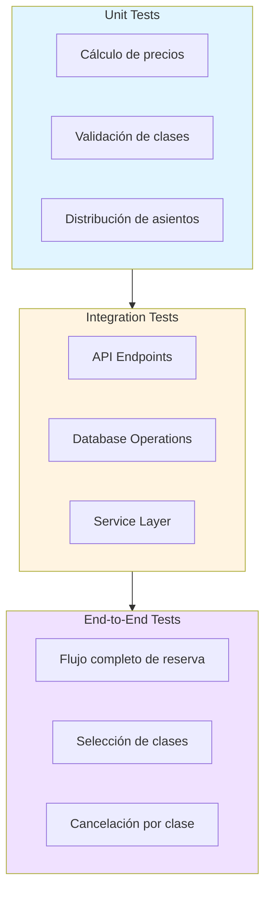
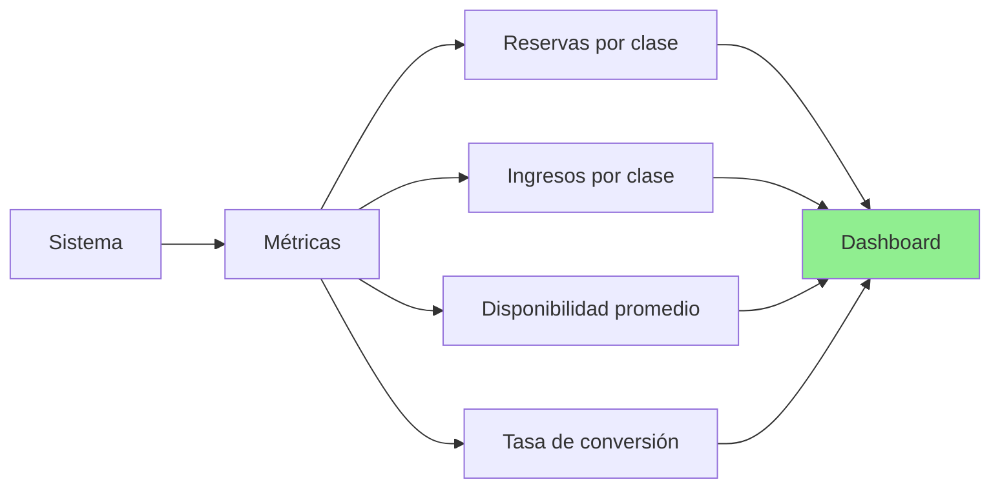

# Arquitectura del Sistema de Clases de Asiento

## 🏛️ Diagrama de Arquitectura General

## 📊 Modelo de Datos Detallado

## 🔄 Flujo de Reserva con Clases

## 💰 Cálculo de Precios

## 🎨 Componentes Frontend

## 🔐 Validaciones y Reglas

## 📱 Estados del Componente SeatClassSelector

## 🗄️ Migración de Datos

## 🧪 Estrategia de Testing

## 📈 Métricas y Monitoreo

---

**Documento creado**: 2026-06-24  
**Versión**: 1.0  
**Relacionado con**: SEAT_CLASSES_DESIGN.md